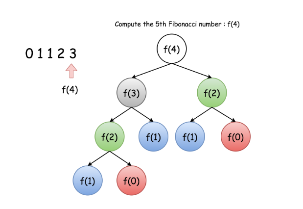

# Steps to follow to solve a Recursion problem

- Think about what function should do, not what it currently does.

- Pick a subproblem and assume your function already works on it.
```buildoutcfg
# Get sum of all values from 1...n
function sumTo(n):
    solutionToSubproblem = sumTo(n-1)  
    # We have picked up appropriate subproblem (n-1) and we assumed that the function already works for this subproblem.
```

- Take the answer to your subproblem, and use it to solve for the original problem.  
We already have sumTo(n-1) which is 1 + 2 + 3 + ... + n-1  
we want to have sumTo(n)   which is 1 + 2 + 3 + ... + n-1 + n  
How do we get the sum from 1 to n, if we have the solution from 1 to n-1? Think about it  
```buildoutcfg
function sumTo(n):
    const solutionToSubproblem = sumTo(n-1)
    return solutionToSubproblem + n
```
we took the solution to our subproblem and found how it’s used to solve the original problem. This is known as finding the recurrence

- We need to add base case to stop it  
To pick up a base case, think of the following:  
**What is the _EASIEST POSSIBLE VALUE_ you can put into the function that requies no extra calculation?**

**Reference**: [How to Think Recursively | Solving Recursion Problems in 4 Steps](https://medium.com/swlh/how-to-think-recursively-solving-recursion-problems-in-4-steps-95a6d07aa866)

## Time Complexity
- Given a recursion algorithm, its time complexity O(T) is typically the product of the number of recursion invocations (denoted as R) and the time complexity of calculation (denoted as O(S)) that incurs along with each recursion call:
```buildoutcfg
O(T) = R * O(S)
```
- For Example, Fibonacci numbers
 Here, the total number of nodes is 2<sup>n</sup> -1 = R   
At each step O(S) = O(1)  
So,  O(T) = O(2<sup>n</sup>)  
Using memoization, the time complexity can be reduced to O(n)

**Reference**: [Time Complexity](https://leetcode.com/explore/learn/card/recursion-i/256/complexity-analysis/1669/)


## Space Complexity
1. Recursion related space
- Space that is incurred directly by the recursion i.e. the stack to keep track of recursive function calls. It includes,  
  1. The returning address of the function call
  2. The parameters that are passed to the function call
  3. The local variables within the function call, once the function call is done, this space is freed
 - For recursive algorithms, the function calls chains up successively until they reach a bash case. This implies that the space that is used for each function call is added.
2. Non Recursion related space
- Space used for global variables
- Space used for saving the intermediate results i.e. memoization  

**Reference**: [Space Complexity](https://leetcode.com/explore/learn/card/recursion-i/256/complexity-analysis/1671/)

